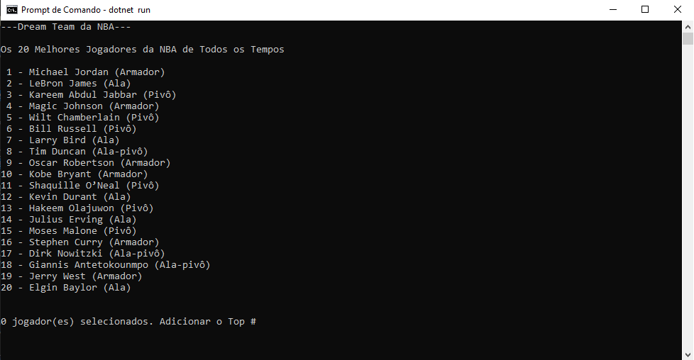
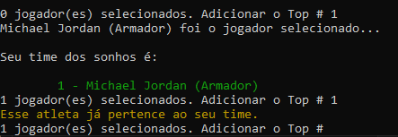
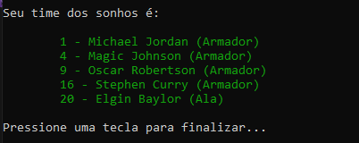

# 🏀 DreamTeam (Time dos sonhos da NBA) 🏀

Já pensou em montar seu time dos sonhos da NBA? Uma equipe de basquete sempre é formada por 5 jogadores de cada time, e cada set possui 12  minutos. Muitos astros já passaram por essa liga e deixaram seu grande legado. 


Com base na lista divulgada pela **ESPN**, Crie seu time dos sonhos de acordo com os [75 Maiores Jogadores da NBA de Todos os Tempos.](https://www.torcedores.com/noticias/2022/02/espn-lista-75-melhores-nba) 

### 20 Maiores Jogadores de Todos os Tempos da NBA

01.  Michael Jordan (Armador)
02.  LeBron James (Ala)
03.  Kareem Abdul Jabbar (Pivô)
04.  Magic Johnson (Armador)
05.  Wilt Chamberlain (Pivô)
06.  Bill Russell (Pivô)
07.  Larry Bird (Ala)
08.  Tim Duncan (Ala-pivô)
09.  Oscar Robertson (Armador)
10.  Kobe Bryant (Armador)
11.  Shaquille O’Neal (Pivô)
12.  Kevin Durant (Ala)
13.  Hakeem Olajuwon (Pivô)
14.  Julius Erving (Ala)
15.  Moses Malone (Pivô)
16.  Stephen Curry (Armador)
17.  Dirk Nowitzki (Ala-pivô)
18.  Giannis Antetokounmpo (Ala-pivô)
19.  Jerry West (Armador)
20.  Elgin Baylor (Ala)

# 📌 Como Funciona Para Montar a Sua Lista?

Para montar seu draft, primeiramente é necessário [baixar o programa](dist/DreamTeam.zip). 

Após a execução do programa, será exibido na tela a lista mencionada, você deverá selecionar seu time que é composto por 5 jogadores.



Você poderá somente selecionar os jogadores que estão na lista. caso contrário, aparecerão as seguintes mensagens.

**Se Já Pertence ao Seu Time**



**Posição Inválida**


Após montar seu draft completo, será exibido seu "DreamTeam" na tela. não a limites de drafts para serem montados, você pode montar quantos times quiser, com base nos jogadores disponibilizados na lista do programa.





## [🏀Faça o download do programa aqui🏀](dist/DreamTeam.zip)

Depois do término do download, extraia os arquivos compactados na pasta desejada e execute o programa no formato (.exe) se for Windows, ou se no caso for outro sistema operacional, execute no formato (.dll). 

```
dotnet TimedosSonhos.dll
```
Esse comando deve ser executado somente dentro da pasta "net8.0"

* Preferência utilizar o Prompt de Comando ou o Powershell.


## Desenvolvedores do Software

[Ryan Riquelme](https://github.com/Floa101213)  - Desenvolvimento & Publicação

[Emerson Lima de Souza](https://github.com/EmersonLSouza)  - Desenvolvimento & Publicação


## Direitos Reservados

[Prof. Ermogenes Palacio](https://github.com/ermogenes) - Idealizador do Projeto

[Prof. Diego Neri](https://github.com/diegoneri) - Idealizador do Projeto
